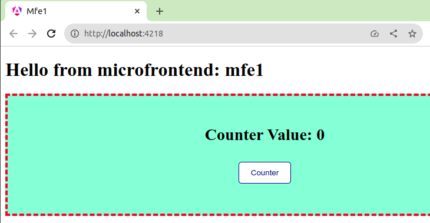

# Micro Frontend mfe1

This project was generated with [Angular CLI](https://github.com/angular/angular-cli) version 17.0.3.

## Development server

Run `ng serve` for a dev server. Navigate to `http://localhost:4200/`. The application will automatically reload if you change any of the source files.

## Code scaffolding

Run `ng generate component component-name` to generate a new component. You can also use `ng generate directive|pipe|service|class|guard|interface|enum|module`.

## Build

Run `ng build` to build the project. The build artifacts will be stored in the `dist/` directory.

## Running unit tests

Run `ng test` to execute the unit tests via [Karma](https://karma-runner.github.io).

## Running end-to-end tests

Run `ng e2e` to execute the end-to-end tests via a platform of your choice. To use this command, you need to first add a package that implements end-to-end testing capabilities.

## Further help

To get more help on the Angular CLI use `ng help` or go check out the [Angular CLI Overview and Command Reference](https://angular.io/cli) page.

# Additional Notes

This project is part of a whole project for micro-frontends with angular. [See doc folder](https://github.com/yonepv/micro-frontend-ng-native-federation-doc)

This part belongs to a micro-frontend with web component in Angular17. It uses native federation (from @angular-architects/native-federation) to generate what is needed to communicate with other applications (to be available for other applications) as the shell application.

* To run the application (install and run):
 ```bash
  pnpm i
  pnpm start
  ```

* In the browser:



## References
- [Micro Frontends with Modern Angular – Part 1: Standalone and esbuild](https://www.angulararchitects.io/en/blog/micro-frontends-with-modern-angular-part-1-standalone-and-esbuild/)
- [Microfrontend Communications in Multi Repo](https://www.youtube.com/playlist?list=PL1UWPWOy5Ulce7Xd0vVP1l7qJ51oLYx_l)
